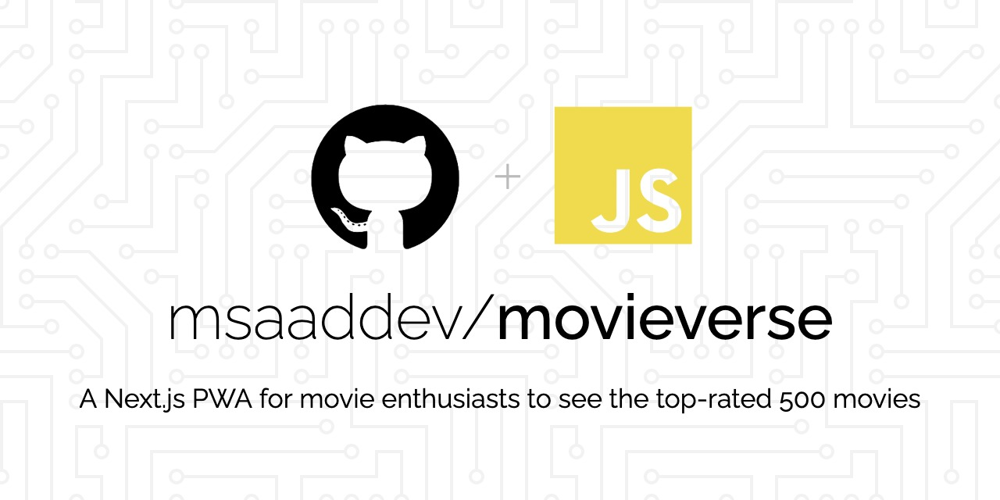

	<strong>Looking for a movie to watch!? Well! You can easily look up not just one but 500 top-rated movies on TMDB</strong>

- **PWA**: A progressive web app so you can also install and use it as a desktop app
- **Static Generation**: Uses Next.js `getStaticProps` to fetch data at build time
- **Movies**: Show you top 500 movies
- **Infinite Scroll**: Does not fetch all the movies at once. Instead, see new movies when you are about to reach the bottom of page.
- **State Persist**: Movies you starred will be starred even if you come back to the site next day.
- **PlaceHolder**: Clean template placeholder that displays when the user is waiting for the data
- **Responsive**: Also looks good on a mobile device
